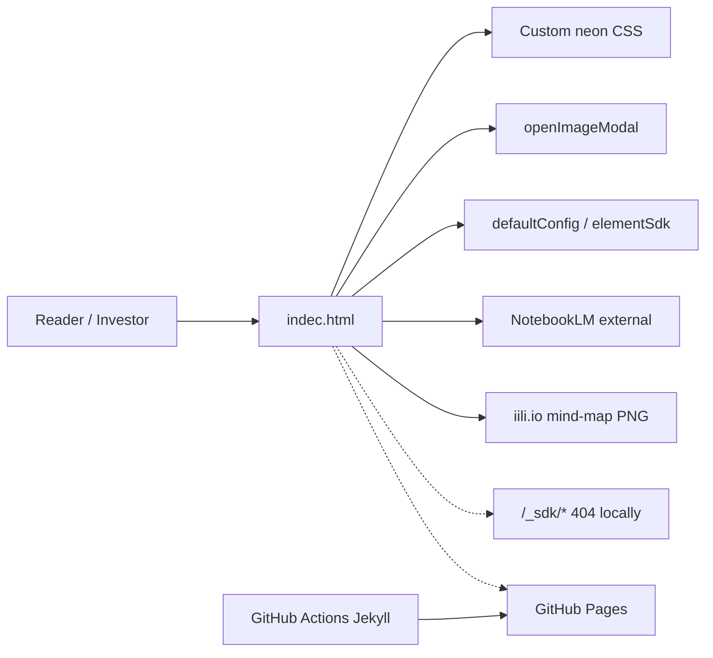

# Intern US Business Investment Report — Comprehensive Repository Analysis & Super-App Elevation Roadmap

**Analysis date:** 2026-07-24  
**Repository root:** repository checkout root (`.`)
**Branch of analysis artifacts:** `main-repo-analysis-super-roadmap-40bc`
**Analyst posture:** Evidence-based static review + live execution (HTTP serve, Puppeteer, interactive browser)

---

## 1. Executive Summary

**Overall health score: 54.1/100** — the equal-weight mean of the seven dimension scores below (379 ÷ 7); strong as a **content-complete static strategic report**, but weak as an **engineered product** or path to a production Intern US platform.

| Dimension | Score | Notes |
|-----------|------:|-------|
| Content completeness | 86 | Dual-perspective strategy, metrics, recommendations present |
| Visual presentation | 72 | Neon theme polished but clashes with residual green inline styles |
| Interactive functionality | 68 | Mind-map modal works; scroll-lock + double-close bugs |
| Engineering hygiene | 28 | No README/tests/license/gitignore; typo entry filename |
| Deploy readiness | 45 | Pages workflows exist; default URL won’t show report |
| AI capability (in-app) | 25 | NotebookLM deep-link only — not an owned AI system |
| Security / POPIA posture | 55 | No PII collection in-repo; external Google redirect needs disclosure |

### Key strengths
- Self-contained static page with no package or application-build dependencies that **loads and delivers investor-facing narrative value today**; external runtime integrations remain optional or content-specific.
- Substantial domain content (SA youth unemployment, WIL, monetisation, competitors, growth).
- Working interactive mind-map lightbox and graceful SDK fallback via `defaultConfig`.
- Documented Cloud agent runbook in `AGENTS.md`.

### Critical gaps
- **Not an application platform** — no auth, data model, matching engine, APIs, or tests.
- Entry file named `indec.html` (not `index.html`) → GitHub Pages / directory root do not serve the report by default.
- Modal bugs: body scroll remains `overflow: hidden` after close; × click can throw `removeChild` NotFoundError.
- Dead/leftover integrations: unused Tailwind CDN, Cloudflare challenge script, duplicate HTML under `.github/workflows/`.
- “AI-Enhanced Analysis” is marketing framing for an **external** NotebookLM link (login-gated).

### Top 5 recommendations
1. **Stabilize packaging:** root `index.html` (or redirect), README, remove dead scripts, sync/dedupe deploy copy.
2. **Fix modal UX bugs** (scroll unlock + stopPropagation) and add `prefers-reduced-motion` / basic a11y.
3. **Unify design system** (neon vs olive) and self-host critical assets (mind map).
4. **Add smoke tests + harden CI** (Playwright open/modal; fail on console 404s for first-party assets).
5. **Decide product thesis:** polished report product **or** Intern US marketplace platform — then Phase-2+ roadmap below.

---

## 2. Project Overview & Detected Tech Stack

### What this project is
A **static HTML business/investment report** titled *Intern US Dual‑Perspective Strategic Analysis*. Intern US is described as a digital platform connecting South African final-year students with industry partners. The repo delivers the **strategy document UI**, not the platform itself.

### Detected stack

| Layer | Technology | Evidence |
|-------|------------|----------|
| Language | HTML5 + CSS3 + vanilla JS | `indec.html` |
| CSS approach | Custom CSS (~750-line `<style>`) + unused Tailwind CDN | Zero Tailwind utility tokens in markup |
| Fonts | System stack (`Segoe UI`, Tahoma, Geneva, Verdana) | `body` CSS / `defaultConfig.font_family` |
| Hosting integration | Element-style SDKs (`element_sdk.js`, `data_sdk.js`) | Script tags; local 404; guarded `elementSdk.init` |
| AI | Google NotebookLM (external) | CTA `a.ai-chat-button` |
| Assets | Remote PNG on `iili.io` | Mind-map `src` |
| Deploy | GitHub Actions + Jekyll → GitHub Pages | `.github/workflows/*.yml` |
| Runtime deps | None | No package manager / lockfile |
| Backend / DB / agents / RAG | **Absent** | Tree has no `src/`, `api/`, `agents/`, etc. |

### Explicit non-stack
No React/Next, no Python/Node app server, no Docker Compose app, no vector DB, no auth, no analytics SDK (beyond leftover CF challenge snippet).

---

## 3. Directory Structure & High-Level Architecture

### Complete tree (tracked / meaningful paths)

```text
.
├── AGENTS.md                          # Cloud agent runbook
├── indec.html                         # PRIMARY APP (report page)
├── COMPREHENSIVE_REPO_ANALYSIS.md     # This analysis (added)
├── REPO_ANALYSIS_MEMORY.md            # Agent persistent state (added)
├── .agent/                            # Agent state dir (added)
├── .index/                            # Project context index (added)
│   ├── README.md
│   ├── file-inventory.md
│   ├── architecture.md
│   ├── key-decisions.md
│   ├── dead-code.md
│   └── context-refresh-log.md
└── .github/
    └── workflows/
        ├── jekyll-gh-pages.yml        # Pages deploy
        ├── jekyll-docker.yml          # Jekyll CI build
        └── index.html                 # DUPLICATE of indec.html (misplaced)
```

**No hidden app code beyond `.git` / `.github`.** No `tests/`, `src/`, `public/`, `_config.yml`, `README.md`, `LICENSE`, or `.gitignore`.

### High-level architecture



**Architecture verdict:** Document-in-a-page pattern. Appropriate for an investor brief; insufficient for a marketplace “super app” without greenfield platform work.

---

## 4. Detailed Findings by Module/File

### 4.1 `indec.html` — Primary surface

| Attribute | Assessment |
|-----------|------------|
| Purpose | Full report: layout, theme, content, modal, host SDK bridge |
| Size | ~81 KB, 1841 lines |
| Status | **Fully complete as a static report (~90%)**; polished visually, incomplete as product engineering |
| Quality | Readable monolith; poor modularity; inline styles mixed with CSS; no modules/types |
| Security | No secrets in-repo; external scripts; leftover CF challenge iframe |
| POPIA | Content discusses SA youth labour market; **no personal data processing in this file** — NotebookLM redirect may involve Google account / doc access (disclose to users) |

**Structure (18 `.report-card` sections observed at runtime):**
1. AI-Enhanced Analysis (NotebookLM CTA)
2. Purpose
3. Student Needs & Behaviours (+ stats)
4. Motivators and Opportunities…
5. Industry Engagement & Expectations
6. Student Recommendations and Metrics
7. Industry Recommendations and Metrics
8. University Ecosystem & Partnerships
9. University Partnership Recommendations…
10. Platform Features & User Experience
11. Platform Recommendations…
12. Monetisation & Financial Models
13. Financial Model Recommendations…
14. Market Landscape & Competitor Analysis
15. Market Analysis Metrics…
16. Strategic Impact & Growth Potential
17. Strategic Growth Recommendations…
18. Strategic Mind Map Overview

**Runtime counts (Puppeteer):** 18 cards, 32 stat items, 28 recommendation cards.

**JS API surface:**
- `defaultConfig` — title/headings/colors/font
- `onConfigChange(newConfig)` — DOM text + body gradient/font updates (**works without SDK**)
- `mapToCapabilities` / `mapToEditPanelValues` — Element host edit panel
- `openImageModal(imageSrc)` — lightbox

**Code quality notes:**
- Animations are intentional and numerous (presence), but no `prefers-reduced-motion`.
- System fonts conflict with “expressive typography” product-design bar if elevating brand UX.
- `modal.onremove = ...` is non-functional (not a DOM event) — intended scroll restore never runs.
- × click bubbles to modal → `closeModal` twice → `removeChild` throws.

**Classification:** Fully complete & polished **as report content**; Partially implemented **as engineered front-end** (~75% of interactive polish; missing a11y, asset ownership, hygiene).

---

### 4.2 `.github/workflows/index.html`

| Attribute | Assessment |
|-----------|------------|
| Purpose | Appears intended as Pages content copy |
| Status | **Misplaced duplicate** — MD5 identical to `indec.html` |
| Risk | Confuses reviewers; Jekyll may publish odd paths; drift risk if only one copy is edited |
| Recommendation | Single source of truth at repo root (`index.html`); workflows should not store page HTML |

---

### 4.3 `.github/workflows/jekyll-gh-pages.yml`

| Attribute | Assessment |
|-----------|------------|
| Purpose | Build + deploy Jekyll site to GitHub Pages on `main` / `workflow_dispatch` |
| Status | **Structurally complete** (Actions template) |
| Gaps | No `_config.yml`; default Pages URL won’t auto-serve `indec.html`; no HTML validation step |
| Quality | Standard permissions/concurrency; fine for static deploy |

---

### 4.4 `.github/workflows/jekyll-docker.yml`

| Attribute | Assessment |
|-----------|------------|
| Purpose | CI build using `jekyll/builder:latest` on push/PR to `main` |
| Status | Complete as smoke build |
| Gaps | `chmod -R 777` is blunt; `latest` tag is non-reproducible; no link/HTML checks |

---

### 4.5 `AGENTS.md`

| Attribute | Assessment |
|-----------|------------|
| Purpose | Cursor Cloud instructions |
| Status | Accurate and useful |
| Quality | Clear serve URL caveat (`/indec.html`), SDK 404 note, modal test hint |

---

### 4.6 Absences (Not Started / Not Relevant yet)

| Missing artifact | Impact |
|------------------|--------|
| `README.md` | Onboarding / Pages URL / how to edit content undocumented for humans |
| `index.html` | Default hosting entry broken |
| `.gitignore` | Future `_site/`, OS junk unprotected |
| `LICENSE` | Unclear reuse rights |
| Tests | Regressions (modal, links) undetected |
| `_config.yml` | Jekyll behavior implicit |
| Backend / auth / DB | N/A today; required for platform vision |

---

## 5. Real App Actions & Functionality Test Results

### Setup executed
```bash
python3 -m http.server 8000
# Open http://127.0.0.1:8000/indec.html
```

### Results matrix

| Action | Method | Result | Evidence |
|--------|--------|--------|----------|
| GET `/indec.html` | curl | **Pass** HTTP 200, 83149 bytes | curl status |
| GET `/` (root) | curl + browser | **Pass (expected)** directory listing — report **not** auto-rendered | AGENTS.md caveat confirmed |
| GET `/_sdk/element_sdk.js` | curl / Puppeteer | **404 / failed** (expected locally) | failed request log |
| GET `/_sdk/data_sdk.js` | Puppeteer | **Failed** | failed request log |
| Tailwind CDN reachability | curl HEAD | **Reachable** (302 → versioned) | network |
| Mind-map image `iili.io` | curl HEAD + browser | **Pass** image/png ~6.1 MB | network response + browser observation |
| NotebookLM CTA href | DOM | **Present** → notebook UUID URL | Puppeteer `aiHref` |
| NotebookLM access | curl HEAD | **302 to Google login** | Not anonymously public |
| Page render / neon theme | Browser | **Pass** | interactive browser observation |
| Sections visible | Browser | **Pass** | interactive browser observation |
| Mind-map click → modal | Browser + Puppeteer | **Pass** overlay + × visible | browser observation + Puppeteer `modalOpen` result |
| Close via backdrop | Both | **Pass** modal removed | `afterClose.modalGone: true` |
| Close via × | Puppeteer | **Partial** — closes but throws `removeChild` NotFoundError | `pageErrors` |
| Body scroll after close | Puppeteer | **Fail** `bodyOverflow` remains `"hidden"` | `afterClose` / `afterX` |
| `onConfigChange` without SDK | Puppeteer | **Pass** title/company/background update | `configTest` |
| Cloudflare challenge script | Puppeteer | **404** `/cdn-cgi/...` | failed + console errors |

### Puppeteer excerpt (evidence)
```json
{
  "httpStatus": 200,
  "before": {
    "h1": "Intern US Dual‑Perspective Strategic Analysis",
    "cards": 18,
    "hasOpenFn": true,
    "elementSdk": "undefined",
    "aiHref": "https://notebooklm.google.com/notebook/d632585d-005c-463d-8d14-791de58338af"
  },
  "afterClose": { "modalGone": true, "bodyOverflow": "hidden" },
  "pageErrors": [
    "DOMException: NotFoundError: Failed to execute 'removeChild' on 'Node': The node to be removed is not a child of this node."
  ]
}
```

### Verdict: real working app?
- **Yes — as a real working static strategic report** delivering narrative + metrics + mind-map exploration.
- **No — as a real Intern US product application** (no matching, profiles, applications, payments, or owned AI).
- Category: **Polished content MVP / investor artifact**, not scaffolding-only, but also **not** a SaaS platform.

---

## 6. Completeness Matrix & Gap Analysis

| Feature / Module | State | Evidence |
|------------------|-------|----------|
| Strategic narrative content | **Done** | 18 sections, dual perspective |
| Visual theme / motion | **Done** (with inconsistency) | Neon CSS + leftover green inline |
| Mind-map display | **Done** | External PNG loads |
| Mind-map lightbox | **In Progress ~80%** | Works; scroll lock + double-close bugs |
| Host SDK theming bridge | **Done** (host-dependent) | Init guarded; local degrade OK |
| In-page AI chat | **Not Started** | External NotebookLM only |
| Default static entry (`index.html`) | **Not Started / Broken default** | `indec.html` only |
| README / license / gitignore | **Not Started** | Absent |
| Automated tests | **Not Started** | Absent |
| Design-token unification | **In Progress ~50%** | Two palettes |
| Self-hosted assets | **Not Started** | iili.io dependency |
| Auth / multi-tenant platform | **Not Started** | Out of scope of current repo |
| Job/internship matching | **Not Started** | Described in content only |
| Payments / monetisation engine | **Not Started** | Described in content only |
| Observability | **Not Started** | No analytics/health |
| POPIA/privacy policy page | **Not Started** | Needed if collecting data later |
| GitHub Pages deploy pipeline | **Done** (config gaps) | Workflows present |

**Overall project health:** Functional **content MVP** with deploy scaffolding; missing product foundations for a platform; several packaging bugs block “open the site URL and see the report.”

---

## 7. Issues, Bugs & Technical Debt (Prioritized)

| ID | Priority | Issue | Evidence / Repro | Suggested fix |
|----|----------|-------|------------------|---------------|
| B1 | **Critical** | Default site entry missing | Open `/` or Pages root → no report | Add `index.html` (copy/rename/redirect from `indec.html`) |
| B2 | **High** | Modal leaves `body { overflow: hidden }` | Open modal → close → `document.body.style.overflow === 'hidden'` | Set overflow restore inside `closeModal`; remove bogus `modal.onremove` |
| B3 | **High** | Double-close throws `removeChild` | Click × (bubbles to modal) | `closeButton.onclick = (e) => { e.stopPropagation(); closeModal(); }`; guard if already removed |
| B4 | **High** | Duplicate page HTML in workflows | `.github/workflows/index.html` == `indec.html` | Single source; optional build copy step |
| B5 | **Medium** | Unused Tailwind CDN | 0 utility classes | Remove script |
| B6 | **Medium** | Cloudflare challenge leftover | 404 `/cdn-cgi/...` | Delete trailing IIFE |
| B7 | **Medium** | Dual color systems | 24× `#455C08` vs neon CSS | Migrate content to CSS variables |
| B8 | **Medium** | Mind-map hosted externally (~6MB) | iili.io dependency | Optimize + self-host in `assets/` |
| B9 | **Medium** | NotebookLM not public | 302 to login | Document access; or embed owned RAG later |
| B10 | **Low** | No `meta description` / OG tags | SEO/share weak | Add meta + Open Graph |
| B11 | **Low** | No a11y semantics | No ARIA on modal; no focus trap | Dialog pattern + Escape key |
| B12 | **Low** | Motion without reduced-motion | Many infinite animations | `@media (prefers-reduced-motion: reduce)` |
| B13 | **Low** | Jekyll CI `chmod 777` + `latest` | `jekyll-docker.yml` | Pin image digest; least privilege |
| B14 | **Low** | Filename typo `indec` | Repo + AGENTS | Prefer `index.html`; keep alias if needed |

---

## 8. Prioritized Next Steps for the Build

Focused on completing the **current vision** (excellent static report + reliable publish).

| # | Action | Why | Effort | Approach |
|---|--------|-----|--------|----------|
| 1 | Add root `index.html` identical (or canonical) to report | Unblocks Pages/default URL | XS | Copy + optional `<link rel=canonical>`; update AGENTS |
| 2 | Fix modal scroll + double-close | Core interactive bug | XS | Patch `closeModal`; stopPropagation; Escape |
| 3 | Strip Tailwind CDN + CF leftover | Clean network/console | XS | Delete scripts |
| 4 | Remove/relocate workflows HTML duplicate | Prevent drift | XS | Delete after root index exists |
| 5 | Add `README.md` + `.gitignore` + LICENSE | Human onboarding | S | Document serve, Pages, edit guide |
| 6 | CSS variables + remove green inline | Visual coherence | M | `:root` tokens; replace inline colors |
| 7 | Self-host compressed mind-map | Reliability + perf | S | WebP/AVIF in `assets/`; keep placeholder |
| 8 | Playwright smoke test in CI | Prevent regressions | S | Load, assert H1, open/close modal, assert overflow |
| 9 | A11y pass on modal + skip link | Inclusive UX | S | `role="dialog"`, focus trap, Escape |
| 10 | Optional: print stylesheet | Investor PDF workflow | S | `@media print` hide neon chrome |

---

## 9. Strategic AI & Technical Recommendations

### Architecture & design
- Keep **static report** as a published artifact; if building Intern US product, create a **separate app repo/monorepo package** (`apps/web`, `apps/api`) — do not grow `indec.html` into a platform.
- Prefer content in structured data (`report.json` / MDX) rendered to HTML for maintainability.
- Containerization only needed when an API appears; until then, Pages/CDN is enough.

### Code quality & maintainability
- Split CSS/JS from HTML when editing frequency rises.
- Introduce Prettier + HTMLValidate in CI.
- Target smoke E2E first (not 80% unit coverage on a static page); if/when an API exists, raise coverage bar to ≥80%.

### AI-specific
Current AI is **off-box NotebookLM**. To own the capability:
1. **Phase A:** Embed a retrieval chatbot over the report corpus (chunk HTML/MD, citations, eval set of 30 investor questions).
2. **Phase B:** Student/employer copilots (CV critique, internship brief generation) with **human-in-the-loop**.
3. **Phase C:** Multi-agent orchestration (matcher, compliance checker for SA labour rules, mentor suggester) with evaluation harness (promptfoo/DeepEval).
4. Prefer **hybrid search** + rerank; log feedback; never train on raw CVs without POPIA basis.
5. Local/privacy option: on-prem or VPC models for CV data; keep marketing report AI separate from PII AI.

### Security & compliance (incl. POPIA)
- Today: low direct risk (static content). Still:
  - Publish privacy notice if NotebookLM/Google processes queries.
  - Avoid collecting ID numbers, school records, or CVs in static host forms without lawful basis, purpose limitation, security safeguards, and operator agreements (POPIA).
  - CSP headers on Pages/CDN; drop unnecessary third-party scripts.
  - Secrets only in env (N/A now); pin CDN versions if any remain.
  - Future marketplace: RBAC, encryption at rest, retention schedules, operator agreements with universities/employers.

### Performance, observability, DevEx
- Compress mind-map; lazy-load below fold (already `loading="lazy"`).
- Add basic analytics (privacy-friendly) + error logging for modal failures.
- Lighthouse CI budget (LCP, CLS — watch animated neon).

### Testing & quality — example cases
1. `/` serves report (or 302 to it).
2. Modal open sets overflow hidden; close restores `''`/`auto`; no pageerror.
3. Mind-map `onerror` shows placeholder when asset blocked.
4. NotebookLM link has `rel="noopener noreferrer"` (already present).
5. `onConfigChange` updates `#report-title` without SDK.

---

## 10. Vision & Phased Roadmap to Super-Level App

### What “super level” looks like
A **production Intern US platform** (not just a report): mobile-first, data-light, multilingual student journeys; employer compliance-aware internship posting; university WIL integrations; transparent matching; impact analytics for funders; AI assistants that respect POPIA; monetisation via SaaS + placement success fees — with the strategic report as the **public thesis / investor microsite**.

### Phase 1 — Stabilize & Complete Core MVP (report product)
**Goal:** Flawless static report + publish path.  
**Deliverables:** B1–B6 fixes, README, index entry, smoke tests, unified theme tokens, self-hosted assets.  
**Success criteria:** Pages root shows report; Lighthouse a11y ≥90 on core page; zero console errors for first-party resources; modal open/close 10× without scroll lock.

### Phase 2 — Polish, Test, Scale Foundations
**Goal:** Treat report as a mini-product; prepare platform foundation.  
**Deliverables:** Content CMS or JSON-driven sections; OG/SEO; print/PDF export; optional embedded RAG Q&A over report; design system; CI pinned; privacy/terms pages; analytics.  
**Success criteria:** Non-engineers can update stats via config; RAG answers cite sections ≥80% accuracy on eval set; deploy preview per PR.

### Phase 3 — Super Features & Differentiation
**Goal:** Build the actual Intern US marketplace.  
**Deliverables:** Auth (students/employers/universities); profiles & verified skills; matching + applications; ETI/WIL compliance helpers; messaging; impact dashboard; BEE/skills-levy aligned billing; mobile PWA offline-lite; feature flags; multi-tenant orgs.  
**Success criteria:** First paid employer cohort; measurable placement rate; POPIA DPIA complete; uptime SLO; model eval gates in CI.

### Effort / impact matrix (selected)

| Item | Impact | Effort | Type |
|------|--------|--------|------|
| `index.html` + modal fixes | High | XS | Quick win |
| Remove dead scripts | Med | XS | Quick win |
| Theme unification | Med | M | Quick win |
| Self-host mind-map | Med | S | Quick win |
| Report RAG chatbot | High | M–L | Strategic bet |
| Full matching marketplace | Very High | XL | Strategic bet |
| University SIS integrations | High | XL | Strategic bet |

### Monetisation / community (platform era)
- Employer SaaS seats + success fee
- SETA/university partnership licenses
- Impact reports for CSI/ESG funders
- Open stats community dashboard (aggregated, anonymised)

---

## 11. Conclusion & Immediate Action Plan

This repository is a **credible, runnable investor/strategy microsite** for Intern US with rich South African labour-market content and a working mind-map lightbox. It is **not** yet a production application platform. Engineering debt is concentrated in **packaging** (filename, duplicates, dead scripts) and **modal correctness**, not in missing narrative.

**Do this next (immediate 48-hour plan):**
1. Canonicalize `index.html` and keep/alias `indec.html` if needed.  
2. Patch modal close (scroll unlock + stopPropagation + Escape).  
3. Delete Tailwind CDN, Cloudflare leftover, and workflows HTML duplicate.  
4. Add README + `.gitignore` + Playwright smoke in CI.  
5. Explicitly choose: **report product** vs **platform build** before large AI/architecture spend.

Memory file updated with phase completion + insights + open questions. Index initialized under `.index/`.

---

## Appendix

### A. Key file references
- `indec.html` — report + CSS + JS  
- `.github/workflows/jekyll-gh-pages.yml` — Pages deploy  
- `.github/workflows/jekyll-docker.yml` — Jekyll CI  
- `.github/workflows/index.html` — duplicate  
- `AGENTS.md` — local run notes  

### B. Analysis commands used
```bash
find . -type f ...
python3 -m http.server 8000
curl -I http://127.0.0.1:8000/indec.html
curl -I https://iili.io/Ksoxuf9.png
curl -I https://notebooklm.google.com/notebook/...
google-chrome --headless=new --screenshot=...
node <temporary-test-script>   # puppeteer-core validation script
# Interactive browser validation (computer-use agent)
```

### C. Artifacts
- No binary runtime artifacts were committed. Screenshots and Puppeteer output were
  temporary analysis-session files and are not cited as durable evidence.
- The reproducible commands above and the results matrix preserve the tested behavior;
  future validation should retain any required artifacts under a tracked project path.

### D. Limitations
- Browser MCP server unavailable; used Puppeteer + computer-use instead.  
- NotebookLM deep content quality not evaluated (login wall).  
- GitHub Pages live URL / Actions run history not fully verified in this environment.  
- No production traffic/analytics data available.  
- “Super-app” roadmap is strategic; implementing it requires a product decision beyond this repo’s current scope.

### E. South African / POPIA note
Report content is macroeconomic/labour analysis, not a personal information store. Future student/employer data, CVs, and chat logs would be **personal information** under POPIA — design consent, minimality, operator agreements, and secure processing **before** collecting any of it. External Google NotebookLM usage should be disclosed to readers.
